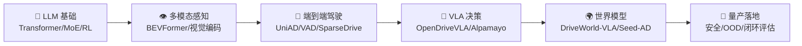

# Signal — 从噪声中提取前沿信号

> AI 驱动的自进化知识平台，由多智能体持续运行，每日自动研究、生成、修订内容。
> **核心方向**：大模型 / VLA / 自动驾驶，兼顾 AI Infra 全景与开源项目源码解析。

## 项目概览

Signal 是一个 **AI 原生的自生长知识平台**。不同于传统需要人工维护的知识库，Signal 由 AI 智能体持续运行，每日自动：

1. 研究 AI 前沿动态（LLM / VLA / 自动驾驶 / AI Infra）
2. 生成/修订书籍章节、技术文章、论文解读
3. 追踪开源项目进展（Airflow / Iceberg / MLflow / Unity Catalog 等）
4. 记录所有修改的进化日志（Git + JSON）

前端使用 Next.js 14 静态导出到 GitHub Pages，零服务器成本。

**当前数据快照（2026-04-24）**：书籍 **13 本** · 文章 **82 篇** · 论文解读 **64 篇**（index 69 条）· 模型 **47 个** · 声浪 **116 条** · 进化日志 **198 条**

---

## 整体架构

```
                        ┌─ 用户浏览器 ─┐
                        │  GitHub Pages │
                        └──────┬───────┘
                               │
┌──────────────────────────────┴──────────────────────────────┐
│                   Next.js 14 (Static Export)                │
│                                                              │
│  ┌────┐ ┌────┐ ┌────┐ ┌────┐ ┌────┐ ┌──────┐ ┌────┐ ┌────┐ │
│  │书架│ │文章│ │论文│ │模型│ │声浪│ │DataInfra│ │VLA │ │工具│ │
│  └────┘ └────┘ └────┘ └────┘ └────┘ └──────┘ └────┘ └────┘ │
├─────────────────────────────────────────────────────────────┤
│                   Markdown + JSON 数据层                     │
│  content/books/  content/articles/  content/papers/         │
│  content/news/   content/evolution-log.json                 │
├─────────────────────────────────────────────────────────────┤
│               CrewAI 多智能体引擎 (Python)                   │
│  agents/run_crew.py  — 研究员 → 编辑 → 审校员流水线          │
├─────────────────────────────────────────────────────────────┤
│              GitHub Actions (CI/CD + 定时调度)               │
│  daily-evolution.yml  每日 06:00 北京时间自动运行            │
│  deploy.yml           推送 main 时自动构建部署               │
└─────────────────────────────────────────────────────────────┘
```

---

## 目录结构

```
signal/
├── .env.example              # 环境变量模板 (OpenAI/DeepSeek/Anthropic)
├── .github/workflows/
│   ├── daily-evolution.yml   # 每日自动: AI生成内容 → Git提交 → 构建部署
│   └── deploy.yml            # 推送main时自动构建部署到GitHub Pages
├── agents/                   # Python 智能体脚本
│   ├── run_crew.py           # [核心] 多智能体内容生产引擎
│   ├── fetch_news.py         # 新闻抓取+分类引擎
│   └── requirements.txt      # crewai, litellm, python-dotenv, pyyaml, requests
├── oss-repos/                # 开源项目源码（shallow clone）
│   ├── iceberg-1.10.1/       # Apache Iceberg
│   ├── airflow-3.2.1/        # Apache Airflow（含 task-sdk/ 独立子包）
│   ├── unitycatalog-0.4.1/   # Unity Catalog
│   └── mlflow-3.11.1/        # MLflow
├── content/                  # [数据层] 所有内容以Markdown+JSON存储
│   ├── books/                # 书籍章节 .md 文件
│   ├── articles/             # 技术文章 .md 文件（82 篇）
│   ├── papers/
│   │   ├── papers-index.json # 69 篇论文索引（含arXiv链接/分类/重要度/tags）
│   │   ├── categories.json   # 分类定义
│   │   └── *.md              # 64 篇论文解读
│   ├── news/
│   │   ├── news-feed.json    # 声浪条目（含分类/来源/摘要）
│   │   └── categories.json   # 6 个新闻分类
│   └── evolution-log.json    # 进化日志（198 条）
├── src/
│   ├── lib/
│   │   ├── content.js        # 数据读取层: Markdown解析/JSON读取/统计
│   │   ├── data-infra-data.js # Data Infra 页面数据
│   │   ├── vla-data.js       # VLA 实验室数据
│   │   ├── lab-data.js       # 前沿实验室数据
│   │   └── ...               # 其他模块数据
│   ├── components/           # React 组件
│   │   ├── Sidebar.js        # 全局侧边栏导航（桌面+移动统一）
│   │   ├── DataInfraViz.js   # Data Infra 全景可视化
│   │   ├── SeedAdArchViz.js  # Seed-AD 架构可视化
│   │   └── ...
│   └── app/                  # Next.js App Router 页面（16 个路由）
│       ├── page.js           # 首页
│       ├── books/            # 书架
│       ├── articles/         # 文章
│       ├── papers/           # 论文
│       ├── models/           # 模型库
│       ├── news/             # 声浪
│       ├── data-infra/       # AI Infra 全景
│       ├── vla/              # VLA 实验室
│       ├── lab/              # 前沿实验室
│       ├── tools/            # 工具箱
│       ├── radar/            # 创业雷达
│       └── ...
├── next.config.js            # 生产环境静态导出 + trailingSlash + basePath=/signal
├── tailwind.config.js        # 主题配置
├── package.json              # Next.js 14 + Tailwind + remark + recharts
└── ai-wiki.md                # [核心] 项目知识库，每次迭代前必读
```

---

## 技术栈

| 层面 | 技术 | 说明 |
|------|------|------|
| **前端框架** | Next.js 14 (App Router) | Static Export，生成纯静态 HTML，部署到 GitHub Pages |
| **样式** | Tailwind CSS 3.4 + @tailwindcss/typography | 响应式设计，prose 排版 |
| **图表** | Recharts 3.8 | 数据可视化（雷达图/折线图/柱状图） |
| **内容解析** | gray-matter + remark + remark-gfm + remark-math + rehype-katex | Markdown frontmatter + GFM + KaTeX 数学公式 |
| **智能体** | CrewAI + LiteLLM | 多 Agent 串行协作，支持 OpenAI/DeepSeek/Anthropic |
| **测试** | Jest 29 | 数据完整性、格式验证 |
| **部署** | GitHub Pages + GitHub Actions | 零成本，每日自动构建部署 |
| **数据存储** | Markdown + JSON 文件 (Git) | 天然版本追溯 |

---

## 内容总览

### 📖 书架（13 本）

**通用知识系列（9 本）**

| 书名 | 章节 |
|------|:---:|
| 《大语言模型从入门到前沿》 | 7 章 |
| 《AI Agent 实战指南》 | 7 章 |
| 《自动驾驶大模型深度研究》 | 7 章 |
| 《PyTorch 原理深度剖析》 | 7 章 |
| 《LLM 推理框架：从原理到优化》 | 7 章 |
| 《AI 面试通关》 | 7 章 |
| 《AI 时代软件行业全景》 | 7 章 |
| 《Code as Proxy — AI 时代的数据安全架构》 | 7 章 |
| 《物理大模型前沿：从 VLA 到世界模型》 | 7 章 |

**开源项目源码解析系列（4 本）**

| 书名 | 版本 |
|------|------|
| 《Apache Iceberg 源码深度解析》 | v1.10.1 |
| 《Apache Airflow 3.x 源码深度解析》 | v3.2.1 |
| 《Unity Catalog 源码深度解析》 | v0.4.1 |
| 《MLflow 3.x 源码深度解析》 | v3.11.1 |

### 📝 文章（82 篇）

覆盖方向：模型架构 (MoE/Transformer) · 对齐技术 (RLHF/DPO/GRPO) · 训推优化 (vLLM/DeepSpeed/KV Cache) · AI Infra (K8s/数据湖仓/向量DB) · Agent 框架 · MCP 协议 · 自动驾驶 VLA · 开源项目进展追踪（Airflow/Iceberg/MLflow/Unity Catalog/Spark/Ray）

### 📄 论文解读（64 篇，index 69 条）

> Tag 主题筛选：🤖 LLM · 👁️ 多模态 · 🚗 自动驾驶 · 🦾 VLA · 🌍 世界模型 · ⚡ 推理优化 · 🎯 强化学习 · 🏗️ 基础架构

#### 🚗 自动驾驶论文演进路线

```
BEVFormer (ECCV 2022)  ──→  纯视觉 BEV 感知奠基
        ↓
UniAD (CVPR 2023 🏆)  ──→  端到端统一框架
        ↓
VAD (ICCV 2023)        ──→  向量化场景表示，超越 UniAD 且快 2.5x
        ↓
SparseDrive (ECCV 2024) ──→  稀疏并行解码，首次 45 FPS 实时端到端
        ↓
OpenDriveVLA (2025)    ──→  引入开源 LLM，语言理解 + 端到端控制
        ↓
DriveWorld-VLA (2026)  ──→  Latent 世界模型 + VLA 统一，"先想后做"
```

### 📡 声浪（116 条，6 个分类）

🚀 模型发布 · 🔬 技术突破 · 🔧 基础设施 · 📦 开源生态 · 🏢 行业动态 · 🛡️ 安全与治理

---

## 页面路由（16 个）

| 路由 | 说明 |
|------|------|
| `/` | 首页：Hero + 平台概览 + 本周快报 + Stats + 热度榜 + 最新文章 + 声浪 + 进化日志 |
| `/books/` | 书架：13 本书，按系列分组 |
| `/articles/` | 文章列表 + 标签筛选 |
| `/papers/` | 论文列表：分类筛选 + Tag 筛选 + 重要性标记 |
| `/models/` | ModelHub：模型图库 / 架构对比 / 评测排行榜 / 数据集探索 / 架构演进 |
| `/news/` | 声浪：116 条，6 分类筛选 |
| `/data-infra/` | AI Infra 全景：K8s / 数据湖仓 / 数据流水线（含 Airflow 3.x 源码解析）/ 计算引擎选型 |
| `/vla/` | VLA 实验室：DriveWorld-VLA / Seed-AD / Alpamayo-R1 三大研究项目 |
| `/lab/` | 前沿实验室：论文速递 + 实验追踪 |
| `/tools/` | 工具箱：仿真工具导航 + Tokenizer 可视化 |
| `/radar/` | 创业雷达 |
| `/quant/` | 量化策略 |
| `/evolution/` | 进化日志时间线 |

---

## 智能体系统

### 核心流水线 (agents/run_crew.py)

```
┌────────────┐    ┌──────────┐    ┌────────────┐
│  研究员     │ →  │  编辑     │ →  │  审校员     │
│  Researcher │    │  Editor  │    │  Reviewer  │
├────────────┤    ├──────────┤    ├────────────┤
│ 调研前沿    │    │ 结构化   │    │ 准确性检查  │
│ 收集数据    │    │ 深入浅出  │    │ 逻辑一致性  │
│ 趋势分析    │    │ 代码示例  │    │ 格式规范   │
└────────────┘    └──────────┘    └────────────┘
```

### 运行模式

```bash
# 全量运行（书籍 + 文章 + 新闻）
python agents/run_crew.py --mode all

# 只生成文章
python agents/run_crew.py --mode article --count 3

# 只生成书籍
python agents/run_crew.py --mode book

# 只生成专栏
python agents/run_crew.py --mode column
```

### 开源项目追踪（oss_watch）

`run_crew.py` 支持 `oss_watch` 字段，生成文章时自动注入 GitHub 仓库链接供 LLM 检索：

| 追踪方向 | 仓库 |
|---------|------|
| Apache Airflow 3.x | apache/airflow |
| Apache Iceberg | apache/iceberg |
| MLflow 3.x | mlflow/mlflow |
| Unity Catalog | unitycatalog/unitycatalog |
| Kubernetes 生态 | kubernetes/kubernetes + Volcano/Koordinator/HAMi |
| Apache Spark 4.x | apache/spark |
| Ray 2.x | ray-project/ray + ray-project/kuberay |

---

## 快速开始

### 开发环境

```bash
# 1. 安装前端依赖
npm install

# 2. 启动开发服务器
npm run dev
# → http://localhost:3000

# 3. 生产构建（输出到 ./out/）
npm run build
```

### AI 内容生成

```bash
# 安装 Python 依赖
pip install -r agents/requirements.txt

# 配置 API Key（可选，不配则用模板模式）
cp .env.example .env
# 编辑 .env 填入 OPENAI_API_KEY 或 ANTHROPIC_API_KEY

# 全量生成
python agents/run_crew.py --mode all --count 3
```

### 部署到 GitHub Pages

1. 创建 GitHub 仓库，推送代码
2. Settings → Pages → Source 选择 "GitHub Actions"
3. Settings → Secrets → 添加 `OPENAI_API_KEY`（可选）
4. 每天早上 6 点自动运行 AI 生成 + 部署

---

## CI/CD

### daily-evolution.yml（每日进化）

```
触发: 每日 UTC 22:00（北京时间 06:00）或手动
  │
  ├── Job 1: generate（AI 内容生成）
  │   ├── Setup Python 3.12
  │   ├── pip install requirements.txt
  │   ├── python agents/run_crew.py --mode all --count 2
  │   └── git add + commit + push
  │
  └── Job 2: deploy（构建部署）
      ├── Setup Node.js 20
      ├── npm ci + npm run build
      └── Deploy to GitHub Pages
```

---

## 内容约定

### Markdown frontmatter

```yaml
---
title: "文章标题"
description: "摘要描述"
date: "2026-04-24"
agent: "研究员→编辑→审校员"
tags:
  - "LLM"
  - "推理优化"
type: "article"           # article | book
book: "书名"              # 仅 book 类型
chapter: "1"              # 仅 book 类型
chapterTitle: "章节标题"   # 仅 book 类型
---
```

### 文件命名规则

- 书籍：`{book-slug}-ch{nn}.md`（如 `ai-agent-ch01.md`）
- 文章：`{title-slug}.md`（如 `rlhf-dpo-grpo.md`）
- 论文：`{paper-id}.md`（如 `deepseek-v3.md`）

---

## 项目愿景：AI → 自动驾驶



每日 AI 进化内容为自动驾驶大模型研究提供持续的知识底座。论文解读模块已覆盖从 BEV 感知到 VLA 端到端的完整技术栈。

---

## 注意事项

1. **新增内容文件后需重启 dev server** — `rm -rf .next && npm run dev`
2. **生产构建要求所有动态路由有对应文件** — `generateStaticParams()` 返回的 slug 必须能找到对应 .md 文件
3. **论文 `hasReview` 字段** — 必须与实际 .md 文件存在性一致
4. **ai-wiki.md** — 每次内容迭代后必须同步更新，是 AI 智能体的核心记忆文件
5. **basePath=/signal** — next.config.js 已配置子路径部署，本地 dev 访问 `localhost:3000`（无 basePath）
