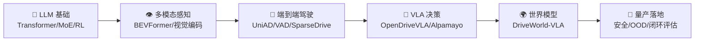

# Signal — 从噪声中提取前沿信号

> AI 驱动的自进化知识平台，由多智能体持续运行，每日自动研究、生成、修订内容。
> **核心方向**：日常进化 AI 前沿知识（LLM / 多模态 / 强化学习），最终服务于自动驾驶大模型研究。

## 项目概览

Signal 是一个 **AI 原生的自生长知识平台**。不同于传统需要人工维护的知识库，Signal 由 3 个 AI 智能体（研究员 → 编辑 → 审校员）以串行流水线方式持续运行，每日自动：

1. 研究 AI 前沿动态
2. 生成/修订书籍章节、技术文章、论文解读
3. 抓取并分类行业新闻
4. 记录所有修改的进化日志（Git + JSON）

前端使用 Next.js 14 静态导出到 GitHub Pages，零服务器成本。

---

## 整体架构

```
                        ┌─ 用户浏览器 ─┐
                        │  GitHub Pages │
                        └──────┬───────┘
                               │
┌──────────────────────────────┴──────────────────────────────┐
│                   Next.js 14 (Static Export)                │
│                                                              │
│  ┌─────┐  ┌─────┐  ┌─────┐  ┌─────┐  ┌────────┐  ┌──────┐ │
│  │ 首页 │  │书架 │  │文章 │  │论文 │  │ AI新闻 │  │进化  │ │
│  │     │  │     │  │     │  │解读 │  │       │  │日志  │ │
│  └─────┘  └─────┘  └─────┘  └─────┘  └────────┘  └──────┘ │
├─────────────────────────────────────────────────────────────┤
│                   Markdown + JSON 数据层                     │
│                                                              │
│  content/                                                    │
  ├── books/        49 章 (7 本书，49 章全部深度充实 ✅)        │
  ├── articles/     63 篇深度文章                             │
  ├── papers/       57 篇论文索引 + 57 篇解读 ✅               │
  ├── news/         99 条新闻 (6 个分类)                      │
│  └── evolution-log.json   进化日志                           │
├─────────────────────────────────────────────────────────────┤
│               CrewAI 多智能体引擎 (Python)                   │
│                                                              │
│  agents/                                                     │
│  ├── run_crew.py       核心流水线: 研究员→编辑→审校员        │
│  ├── fetch_news.py     新闻抓取 + 关键词自动分类             │
│  ├── split_ad_report.py 报告拆分工具                         │
│  └── fix_papers_index.py 论文索引修复                        │
├─────────────────────────────────────────────────────────────┤
│              GitHub Actions (CI/CD + 定时调度)                │
│                                                              │
│  daily-evolution.yml   每日 06:00 北京时间自动运行           │
│  deploy.yml            推送 main 时自动构建部署              │
└─────────────────────────────────────────────────────────────┘
```

---

## 目录结构

```
maxwell-knowledge/
├── .env.example              # 环境变量模板 (OpenAI/DeepSeek/Anthropic)
├── .github/workflows/
│   ├── daily-evolution.yml   # 每日自动: AI生成内容 → Git提交 → 构建部署
│   └── deploy.yml            # 推送main时自动构建部署到GitHub Pages
├── agents/                   # Python 智能体脚本
│   ├── run_crew.py           # [核心] 多智能体内容生产引擎 (581行)
│   ├── fetch_news.py         # 新闻抓取+分类引擎 (265行)
│   ├── split_ad_report.py    # Claw自动驾驶报告拆分工具
│   ├── fix_papers_index.py   # 论文索引hasReview字段修复
│   └── requirements.txt      # crewai, litellm, python-dotenv, pyyaml, requests
├── content/                  # [数据层] 所有内容以Markdown+JSON存储
│   ├── books/                # 书籍章节 (21个 .md 文件)
│   ├── articles/             # 技术文章 (33个 .md 文件)
  ├── papers/               # 论文解读
   │   ├── papers-index.json # 51篇论文索引 (含arXiv链接/分类/重要度/tags)
   │   ├── categories.json   # 4个分类定义
   │   └── *.md              # 51篇论文解读 (含自动驾驶专题)
│   ├── news/
│   │   ├── news-feed.json    # 10条新闻 (含分类/来源/摘要)
│   │   └── categories.json   # 4个新闻分类
│   ├── notes/                # 笔记 (预留，当前为空)
│   └── evolution-log.json    # 进化日志 (50条)
├── src/                      # [前端源码]
│   ├── lib/
│   │   └── content.js        # 数据读取层: Markdown解析/JSON读取/统计
│   ├── components/
│   │   ├── Navbar.js          # 导航栏 (Logo+6个页面+进化状态徽章)
│   │   ├── ContentCard.js     # 通用内容卡片
│   │   ├── EvolutionMechanism.js  # 进化机制三卡片
│   │   ├── NewsFeed.js        # 新闻列表+分类筛选
│   │   └── PapersList.js      # 论文列表+分类筛选+星级
│   └── app/                  # Next.js App Router 页面
│       ├── layout.js          # 根布局 (lang="zh-CN")
│       ├── globals.css        # 全局样式 (Tailwind+动画+暗色主题变量)
│       ├── page.js            # 首页 (Hero+进化机制+统计+文章+新闻+日志)
│       ├── books/
│       │   ├── page.js        # 书架列表 (按书分组)
│       │   └── [slug]/page.js # 章节详情
│       ├── articles/
│       │   ├── page.js        # 文章列表 (3列网格)
│       │   └── [slug]/page.js # 文章详情
│       ├── papers/
│       │   ├── page.js        # 论文列表 (分类筛选+arXiv链接)
│       │   └── [slug]/page.js # 论文解读详情
│       ├── news/
│       │   └── page.js        # 新闻列表 (分类筛选)
│       └── evolution/
│           └── page.js        # 进化日志 (时间线UI)
├── next.config.js            # 生产环境静态导出 + trailingSlash
├── tailwind.config.js        # maxwell紫色主题 + Inter/Noto Sans SC字体
├── package.json              # Next.js 14 + Tailwind + remark + gray-matter
└── README.md                 # 本文件
```

---

## 技术栈

| 层面 | 技术 | 说明 |
|------|------|------|
| **前端框架** | Next.js 14 (App Router) | Static Export 模式，生成纯静态 HTML |
| **样式** | Tailwind CSS 3.4 + @tailwindcss/typography | 响应式设计，prose 排版，暗色主题预留 |
| **内容解析** | gray-matter + remark + remark-gfm + remark-html + remark-math + rehype-katex | Markdown frontmatter 解析 + GFM 表格/代码块渲染 + KaTeX 数学公式 |
| **智能体** | CrewAI + LiteLLM | 多 Agent 串行协作，支持 OpenAI/DeepSeek/Anthropic |
| **测试** | Jest 29 | 自动化测试覆盖数据完整性、格式验证、内容质量 |
| **部署** | GitHub Pages + GitHub Actions | 零成本，每日自动构建部署 |
| **数据存储** | Markdown + JSON 文件 (Git) | 天然版本追溯，所有修改可回溯 |

---

## 内容总览

### 📖 书架 (5 本书，35 章全部深度充实 ✅)

| 书名 | 章节数 | 完成度 | 说明 |
|------|:---:|:---:|------|
| **大语言模型从入门到前沿** | 7 章 | 7/7 ✅ | Ch1 Transformer → Ch2 预训练 → Ch3 对齐 → Ch4 推理优化 → Ch5 多模态 → Ch6 Agent(14KB) → Ch7 前沿 |
| **AI Agent 实战指南** | 7 章 | 7/7 ✅ | Ch1 概述(16KB) → Ch2 ReAct → Ch3 工具/MCP → Ch4 多Agent → Ch5 记忆 → Ch6 生产部署 → Ch7 案例 |
| **自动驾驶大模型深度研究** | 7 章 | 7/7 ✅ | Ch1 数据 → Ch2 数据平台 → Ch3 训练推理 → Ch4 BEV/占用 → Ch5 VLA → Ch6 安全/OOD → Ch7 趋势 |
| **PyTorch 原理深度剖析** | 7 章 | 7/7 ✅ | Ch1 Tensor → Ch2 Autograd → Ch3 nn.Module → Ch4 优化器 → Ch5 torch.compile → Ch6 分布式 → Ch7 性能分析 |
| **LLM 推理框架：从原理到优化** | 7 章 | 7/7 ✅ | Ch1 瓶颈分析(14KB) → Ch2 vLLM → Ch3 调度 → Ch4 TensorRT → Ch5 量化(19KB) → Ch6 分布式 → Ch7 前沿(14KB) |

### 📝 文章 (49 篇)

覆盖方向：模型架构 (MoE/Transformer) | 对齐技术 (RLHF/DPO/GRPO) | 训推优化 (vLLM/DeepSpeed/KV Cache) | 工具评测 (Cursor/Windsurf/Copilot) | AI 安全 | 行业分析 (GPT-6/Sora/SpaceX-xAI) | Agent 框架 (CrewAI/LangGraph/AutoGen) | MCP 协议与生态 | RAG 2.0 | 基础模型格局 | 开发者工具 | DeepSeek V4 | DriveWorld-VLA | Claude Mythos | GLM-5.1 开源 | GPT-6 Eve | Llama 4 Behemoth | AI 编程 Agent 2026 | 课程强化学习 | MAI-1.5 多模态 | GPU 云经济学 | NVIDIA Rubin/Dynamo | AI Infra (K8s/数据湖仓/向量DB/Data Agent) | AlphaProof 2 数学推理 | MCP 生态 2026 标准化 | AI 推理成本经济学 FinOps | Agent 安全治理 | Transformer 预测崩溃 | LLM 情绪向量可解释性 | **GPT-5.5 Spud 超级应用** | **世界模型元年 Genie 3**

### 📄 论文解读 (42 篇索引，42 篇已解读 ✅)

> 新增 Tag 主题筛选：🤖 LLM · 👁️ 多模态 · 🚗 自动驾驶 · 🦾 VLA · 🌍 世界模型 · ⚡ 推理优化 · 🎯 强化学习 · 🏗️ 基础架构

| 方向 | 已解读 |
|------|--------|
| 🏗️ 模型架构 | Transformer, Llama 3, DeepSeek-V3, Mamba, DriveWorld-VLA, LLM4AD, OpenDriveVLA, Gemma 4, BLT, Genie 2, Prediction Collapse, World Models AD Survey, **UniAD**, **BEVFormer**, **VAD**, **SparseDrive** |
| 🎯 训练与对齐 | DPO, DeepSeek-R1, Chinchilla, Quiet-STaR, MoE Instruction Tuning, DAPO, ReSearch, SWE-RL, RECAP, Scaling Monosemanticity, Emotion Vectors |
| ⚡ 推理优化 | FlashAttention, PagedAttention (vLLM), Speculative Decoding, DistServe, Test-Time Compute, Alpamayo-R1, SnapKV, FlashOcc |
| 📊 数据与合成 | Textbooks Are All You Need, Self-Instruct, FineWeb |

#### 🚗 自动驾驶论文演进路线

```
BEVFormer (ECCV 2022)  ──→  纯视觉 BEV 感知奠基，多相机→统一 BEV 特征
        ↓
UniAD (CVPR 2023 🏆)  ──→  端到端统一框架，感知/预测/规划协同优化
        ↓
VAD (ICCV 2023)        ──→  向量化场景表示，超越 UniAD 且快 2.5x
        ↓
SparseDrive (ECCV 2024) ──→  稀疏并行解码，首次 45 FPS 实时端到端
        ↓
OpenDriveVLA (2025)    ──→  引入开源 LLM，语言理解 + 端到端控制
        ↓
DriveWorld-VLA (2026)  ──→  Latent 世界模型 + VLA 统一，"先想后做"
```

### 📡 声浪 (91 条，6 个分类)

分类：🚀 模型发布 (18) | 🔬 技术突破 (29) | 🔧 基础设施 (24) | 📦 开源生态 (8) | 🏢 行业动态 (10) | 🛡️ 安全与治理 (2)

---

## 智能体系统

### 核心流水线 (agents/run_crew.py)

```
┌────────────┐    ┌──────────┐    ┌────────────┐
│  研究员     │ →  │  编辑     │ →  │  审校员     │
│  Researcher │    │  Editor  │    │  Reviewer  │
├────────────┤    ├──────────┤    ├────────────┤
│ 调研前沿    │    │ 结构化   │    │ 准确性检查  │
│ 收集数据    │    │ 深入浅出  │    │ 逻辑一致性  │
│ 趋势分析    │    │ 代码示例  │    │ 格式规范   │
└────────────┘    └──────────┘    └────────────┘
```

### 运行模式

```bash
# 全量运行 (书籍 + 文章 + 新闻)
python agents/run_crew.py --mode all

# 只生成文章 (3 篇)
python agents/run_crew.py --mode article --count 3

# 只生成书籍
python agents/run_crew.py --mode book

# 只抓取新闻
python agents/run_crew.py --mode news
```

### 两种工作模式

| 模式 | 条件 | 说明 |
|------|------|------|
| **CrewAI 模式** | 安装 crewai + 配置 API Key | 真正的多智能体协作，LLM 生成高质量内容 |
| **模板模式** | 默认 (无需 API Key) | 使用预设模板生成结构化内容，适合开发测试 |

### 新闻分类引擎 (agents/fetch_news.py)

基于关键词规则自动分类，支持 `category_override` 手动覆盖。6 大分类各有独立关键词列表（~20 个关键词/分类）。

---

## 前端页面

### 页面路由

| 路由 | 组件 | 数据来源 | 说明 |
|------|------|---------|------|
| `/` | `page.js` | books + articles + news + logs | 首页: Hero + 进化机制 + 统计 + 内容预览 |
| `/books/` | `books/page.js` | `content/books/*.md` | 书架列表，按书名分组 |
| `/books/[slug]/` | `books/[slug]/page.js` | 单个 .md | 章节详情，prose 排版 |
| `/articles/` | `articles/page.js` | `content/articles/*.md` | 文章网格列表 |
| `/articles/[slug]/` | `articles/[slug]/page.js` | 单个 .md | 文章详情 |
| `/papers/` | `papers/page.js` | `papers-index.json` | 论文列表，分类筛选 + 星级 |
| `/papers/[slug]/` | `papers/[slug]/page.js` | `papers/*.md` | 论文解读详情 |
| `/news/` | `news/page.js` | `news-feed.json` | 新闻列表，分类筛选 |
| `/evolution/` | `evolution/page.js` | `evolution-log.json` | 进化日志时间线 |

### 组件清单

| 组件 | 类型 | 功能 |
|------|------|------|
| `Navbar` | Client | 导航栏 + 移动端菜单 + "自主进化中" 状态徽章 |
| `ContentCard` | Server | 通用卡片 (标签 + 标题 + 描述 + 日期 + Agent) |
| `EvolutionMechanism` | Server | 三大进化机制卡片 |
| `NewsFeed` | Client | 新闻列表 + 分类筛选器 |
| `PapersList` | Client | 论文列表 + **双层筛选（分类 × 主题 Tag）** + 原文链接 + 解读链接 |

### 数据读取层 (src/lib/content.js)

| 函数 | 返回 | 说明 |
|------|------|------|
| `getAllContent(type)` | `[{slug, title, date, tags, ...}]` | 读取 books/articles/notes 的所有 .md 文件 |
| `getContentBySlug(type, slug)` | `{contentHtml, ...}` | 读取单篇 + remark 渲染为 HTML |
| `getEvolutionLogs()` | `[{date, type, agent, message}]` | 读取进化日志 JSON |
| `getNewsFeed()` | `[{title, source, category, ...}]` | 读取新闻 JSON |
| `getNewsCategories()` | `[{id, name, icon, count}]` | 读取新闻分类 |
| `getPapersIndex()` | `[{id, title, hasReview, arxivUrl, tags, ...}]` | 读取论文索引（含 tags 字段） |
| `getPaperCategories()` | `[{id, name, icon}]` | 读取论文分类 |
| `getPaperReview(slug)` | `{contentHtml, ...}` | 读取论文解读 .md + 渲染 |
| `getStats()` | `{totalContent, books, articles, ...}` | 计算全站统计数据 |

---

## CI/CD 与自动化

### daily-evolution.yml (每日进化)

```
触发: 每日 UTC 22:00 (北京时间 06:00) 或手动
  │
  ├── Job 1: generate (AI 内容生成)
  │   ├── Setup Python 3.12
  │   ├── pip install requirements.txt
  │   ├── python agents/run_crew.py --mode all --count 2
  │   └── git add + commit + push (Signal AI Bot)
  │
  └── Job 2: deploy (构建部署)
      ├── Setup Node.js 20
      ├── npm ci + npm run build
      ├── Upload artifact (./out)
      └── Deploy to GitHub Pages
```

### deploy.yml (推送部署)

推送 main 分支时自动触发 → 构建 → 部署到 GitHub Pages

---

## 快速开始

### 开发环境

```bash
# 1. 安装前端依赖
npm install

# 2. 启动开发服务器
npm run dev
# → http://localhost:3000

# 3. 生产构建 (输出到 ./out/)
npm run build
```

### AI 内容生成

```bash
# 安装 Python 依赖
pip install -r agents/requirements.txt

# 配置 API Key (可选，不配则用模板模式)
cp .env.example .env
# 编辑 .env 填入 OPENAI_API_KEY

# 全量生成
python agents/run_crew.py --mode all --count 3

# 只生成文章
python agents/run_crew.py --mode article --count 5
```

### 部署到 GitHub Pages

1. 创建 GitHub 仓库，推送代码
2. Settings → Pages → Source 选择 "GitHub Actions"
3. Settings → Secrets → 添加 `OPENAI_API_KEY`（可选）
4. 每天早上 6 点自动运行 AI 生成 + 部署

---

## 内容约定

### Markdown 文件结构 (frontmatter)

```yaml
---
title: "文章标题"
description: "摘要描述"
date: "2026-04-11"
updatedAt: "2026-04-11 16:00"
agent: "研究员→编辑→审校员"
tags:
  - "LLM"
  - "推理优化"
type: "article"           # article | book
book: "书名"              # 仅 book 类型
chapter: "1"              # 仅 book 类型
chapterTitle: "章节标题"   # 仅 book 类型
---

# 正文内容 (Markdown)
```

### 文件命名规则

- 纯 ASCII slug，中文标题用 md5 短 hash
- 书籍: `{book-slug}-ch{nn}.md` (如 `ai-agent-ch01.md`)
- 文章: `{title-slug}.md` (如 `rlhf-dpo-grpo.md`)
- 论文: `{paper-id}.md` (如 `deepseek-v3.md`)

### 进化日志格式 (evolution-log.json)

```json
{
  "date": "2026-04-11 18:11",
  "type": "article",       // book | article
  "agent": "文章智能体",
  "message": "生成深度专栏: xxx",
  "slug": "article-slug"
}
```

---

## 如何扩展内容

### 新增一本书

1. 在 `content/books/` 下创建 `{book-slug}-ch01.md` ~ `ch0N.md`
2. frontmatter 中设置 `book: "书名"`, `chapter: "N"`, `chapterTitle: "章节标题"`
3. 重启 dev server (`rm -rf .next && npm run dev`)

### 新增论文解读

1. 在 `content/papers/papers-index.json` 中添加论文条目
2. 设置 `hasReview: true`，并填写 `tags` 数组（可选值：`llm` / `多模态` / `自动驾驶` / `vla` / `世界模型` / `推理优化` / `强化学习` / `基础架构`）
3. 创建 `content/papers/{paper-id}.md` 解读文件
4. 重启 dev server

### 新增新闻

编辑 `content/news/news-feed.json`，添加新闻条目。或运行 `python agents/fetch_news.py` 生成种子新闻。

---

## 项目愿景：AI → 自动驾驶

Signal 的知识积累遵循一条清晰的路径：



每日 AI 进化内容（LLM 对齐、推理优化、强化学习等）为自动驾驶大模型研究提供持续的知识底座。论文解读模块已覆盖从 BEV 感知到 VLA 端到端的完整技术栈。

---

## 已知注意事项

1. **新增内容文件后需重启 dev server** — Next.js dev 模式不会自动发现新 .md 文件，需要 `rm -rf .next && npm run dev`
2. **生产构建要求所有动态路由有对应文件** — `generateStaticParams()` 返回的 slug 必须能找到对应 .md 文件，否则 build 报错
3. **论文 `hasReview` 字段** — 必须与实际 .md 文件存在性一致，不一致时运行 `python agents/fix_papers_index.py` 修复
4. **模板模式** — 未配置 API Key 时自动降级为模板生成，内容较基础但结构完整
